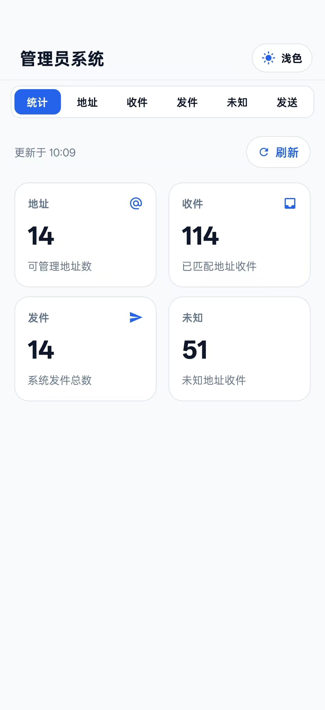
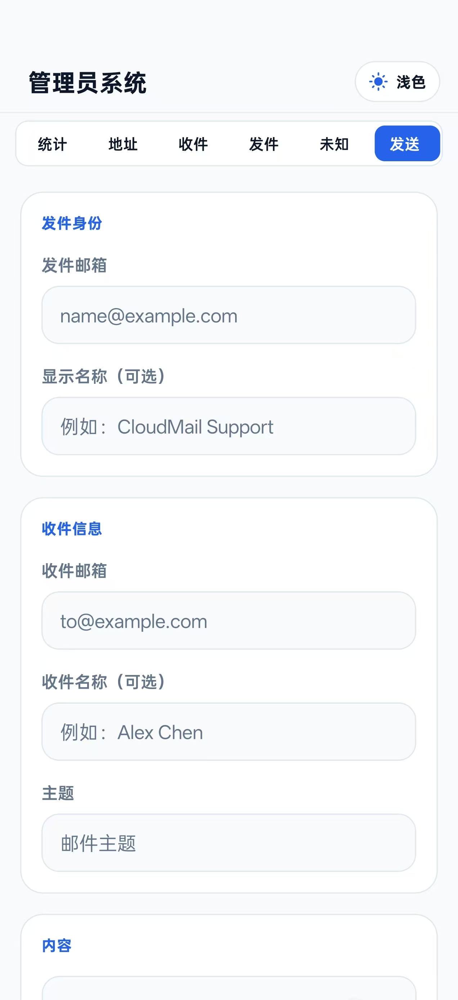
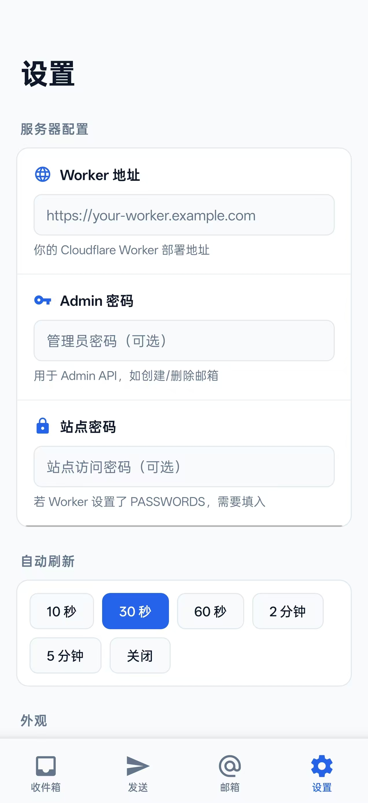
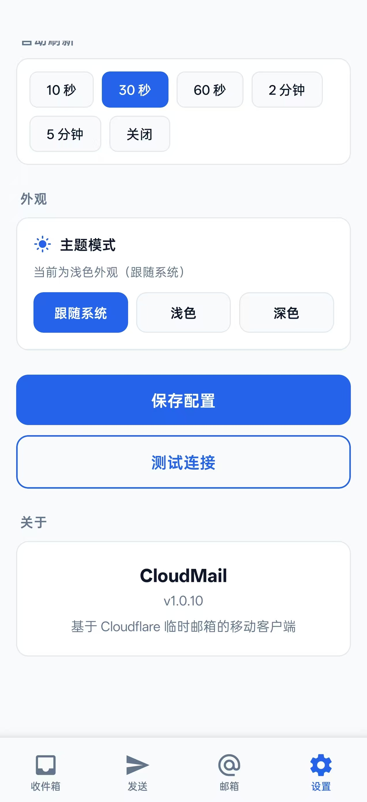

<div align="center">
  

# CloudMail

面向 Cloudflare 临时邮箱系统的移动端管理员客户端。

[](https://github.com/Lur1N77777/CloudMail/actions/workflows/ci.yml)
[](./LICENSE)
[](https://expo.dev/)
[](https://reactnative.dev/)
[](https://www.typescriptlang.org/)

[简体中文](./README.md) · [English](./README.en.md)

[下载 APK](https://github.com/Lur1N77777/CloudMail/releases) · [从源码构建](./BUILD.md) · [API 说明](./docs/mailbox-api-report.md)

</div>

## CloudMail 是什么

CloudMail 是一个基于 Expo / React Native 构建的移动端邮箱管理应用。它面向管理员使用场景，帮助你在手机上集中管理临时邮箱地址、收件箱、发件箱、未知收件地址、验证码邮件和 HTML 邮件内容。

CloudMail 的邮箱后端/API 兼容能力来自 [dreamhunter2333/cloudflare_temp_email](https://github.com/dreamhunter2333/cloudflare_temp_email)。CloudMail 在这个 Cloudflare 临时邮箱系统生态上提供移动端管理员体验。

## 功能亮点

- **管理员优先**：打开应用后连接你的邮箱服务，即可集中管理邮箱地址和邮件。
- **邮箱地址管理**：支持创建自定义邮箱、随机邮箱、子域名邮箱。
- **收件 / 发件 / 未知地址**：查看收件箱、发件箱，以及发往未创建地址的邮件。
- **验证码快捷处理**：识别常见验证码，并支持快速复制。
- **HTML 与文本邮件阅读**：支持富文本 HTML、纯文本和源文本查看。
- **本地分组**：给邮箱地址分组，并按分组筛选邮件。
- **移动端体验**：紧凑卡片、深色/浅色模式、本地缓存、增量刷新。
- **自托管友好**：邮箱服务由你自己部署和控制。

## 截图

点击缩略图可以打开原图查看。

| 预览 | 说明 |
| --- | --- |
| <a href="./docs/screenshots/admin-dashboard.jpg"></a> | **管理员统计面板**：集中展示可管理地址、已匹配收件、系统发件和未知地址收件数量，支持刷新和顶部标签切换。 |
| <a href="./docs/screenshots/compose-mail.jpg"></a> | **发件界面**：从指定邮箱身份发信，按移动端表单排布发件人、收件人、主题和内容。 |
| <a href="./docs/screenshots/settings-server.jpg"></a> | **服务器配置**：填写 Cloudflare Worker 地址、管理员密码、站点密码，并设置自动刷新间隔。 |
| <a href="./docs/screenshots/settings-appearance.jpg"></a> | **外观与应用设置**：切换刷新间隔和主题模式，支持测试连接并查看当前版本信息。 |

## 下载

从 [GitHub Releases](https://github.com/Lur1N77777/CloudMail/releases) 下载最新版 APK。

APK 不会直接提交到源码仓库，这样可以保持 Git 历史干净，也方便后续审计和版本管理。

## 上游邮箱系统

CloudMail 面向兼容 [cloudflare_temp_email](https://github.com/dreamhunter2333/cloudflare_temp_email) 的邮箱系统开发。

感谢 [dreamhunter2333](https://github.com/dreamhunter2333) 和上游项目贡献者提供 Cloudflare 临时邮箱系统与相关 API 行为。CloudMail 在此基础上补充移动端管理员客户端体验。

更多致谢信息见 [NOTICE](./NOTICE)。

## 技术栈

- Expo / React Native
- TypeScript
- Expo Router
- AsyncStorage / SecureStore
- WebView 邮件预览
- Vitest
- 可选 Drizzle 后端工具

## 下载 APP 后怎么使用

### 1. 准备你的邮箱服务

CloudMail 需要连接到一个已经部署好的 `cloudflare_temp_email` 兼容服务。你需要提前准备：

- **Worker 地址**：例如 `https://your-worker.example.com`。
- **Admin 密码**：如果你的后端配置了管理员密码，用它进入管理员系统。
- **站点密码**：如果 Worker 配置了 `PASSWORDS`，需要在 APP 里填写。

如果你还没有部署邮箱后端，请先参考上游项目 [cloudflare_temp_email](https://github.com/dreamhunter2333/cloudflare_temp_email) 完成部署。

### 2. 安装并连接服务

1. 从 [GitHub Releases](https://github.com/Lur1N77777/CloudMail/releases) 下载最新版 APK。
2. 在 Android 手机上安装 APK。
3. 打开 CloudMail，进入底部 **设置**。
4. 在 **Worker 地址** 中填写你的 Cloudflare Worker 地址。
5. 如果有 **Admin 密码** 和 **站点密码**，一起填入。
6. 点击 **测试连接**，确认能正常连到 Worker。
7. 点击 **保存配置**。

### 3. 登录并进入管理员界面

CloudMail 会优先以管理员端使用方式展示：

1. 在 **设置** 页面填好 **Admin 密码** 并保存。
2. 页面下方会出现 **管理员** 区块。
3. 点击 **进入管理员模式**。
4. 输入管理员密码，点击 **进入**。
5. 登录成功后会进入 **管理员系统**。

之后再次打开 APP 时，如果管理员密码仍然有效，CloudMail 会自动进入管理员系统。

如果你暂时没有看到 **管理员** 区块，可以在 **设置 → 关于 → CloudMail** 卡片上连续点击几次，也可以打开管理员登录入口。

### 4. 管理员系统里可以做什么

进入管理员系统后，可以使用顶部标签切换不同功能：

- **统计**：查看地址数、收件数、发件数和未知地址收件数。
- **地址**：查看、搜索、创建和管理邮箱地址。
- **收件**：查看全部收件，支持搜索和按分组筛选。
- **发件**：查看系统发件记录。
- **未知**：查看发往未创建邮箱地址的邮件，并可一键创建对应邮箱。
- **发送**：指定发件邮箱，发送邮件。

### 5. 创建邮箱

1. 进入 **管理员系统 → 地址**。
2. 点击创建邮箱入口。
3. 选择或填写邮箱前缀、域名、子域名或随机邮箱选项。
4. 创建成功后，新邮箱会出现在地址列表中。
5. 后续可以给邮箱分组，方便按用途管理。

### 6. 收验证码和查看邮件

1. 进入 **管理员系统 → 收件**。
2. 等待自动刷新，或手动刷新。
3. 找到对应邮件后点击进入详情。
4. 如果邮件中识别到验证码，可以直接点击验证码快捷复制。
5. HTML 邮件会以富文本方式预览，也可以在详情里查看文本/源内容。

### 7. 处理未知收件地址

如果有人给你的域名下某个还没创建的地址发邮件：

1. 进入 **管理员系统 → 未知**。
2. 查看真实收件邮箱和邮件内容。
3. 如果这个地址需要保留，点击 **创建**。
4. 创建成功后，该地址会进入可管理邮箱列表。
## 本地开发

安装依赖：

```bash
pnpm install
```

启动开发环境：

```bash
pnpm dev
```

只启动 Expo：

```bash
pnpm dev:metro
```

提交 PR 前建议运行：

```bash
pnpm check
pnpm test
```

## 配置环境变量

复制示例配置：

```bash
cp .env.example .env.local
```

大多数邮箱连接配置都在应用内完成。环境变量主要用于本地开发、可选 OAuth / 服务端能力、数据库工具、Forge 集成和 AI 相关工具。

不要提交真实密码、管理员 token、邮箱凭证、API key 或数据库连接串。

## 构建 Android APK

完整说明见 [BUILD.md](./BUILD.md)。

常用本地构建流程：

```bash
pnpm install
npx expo prebuild -p android --clean
cd android
./gradlew assembleRelease
```

生成的 APK 建议上传到 GitHub Releases，不要提交到 Git 仓库。

## 项目文档

- [构建与安装指南](./BUILD.md)
- [设计说明](./docs/design.md)
- [邮箱 API 报告](./docs/mailbox-api-report.md)
- [路线图](./docs/roadmap.md)
- [安全策略](./SECURITY.md)
- [贡献指南](./CONTRIBUTING.md)

## 贡献

欢迎提交 issue 和 pull request。请保持改动聚焦，提交前运行检查，不要在提交中包含密钥或生成的 APK 文件。

## 许可证

CloudMail 使用 [MIT License](./LICENSE) 开源。

上游邮箱系统为 [dreamhunter2333/cloudflare_temp_email](https://github.com/dreamhunter2333/cloudflare_temp_email)。请同时查看上游仓库的许可证和使用条款。

