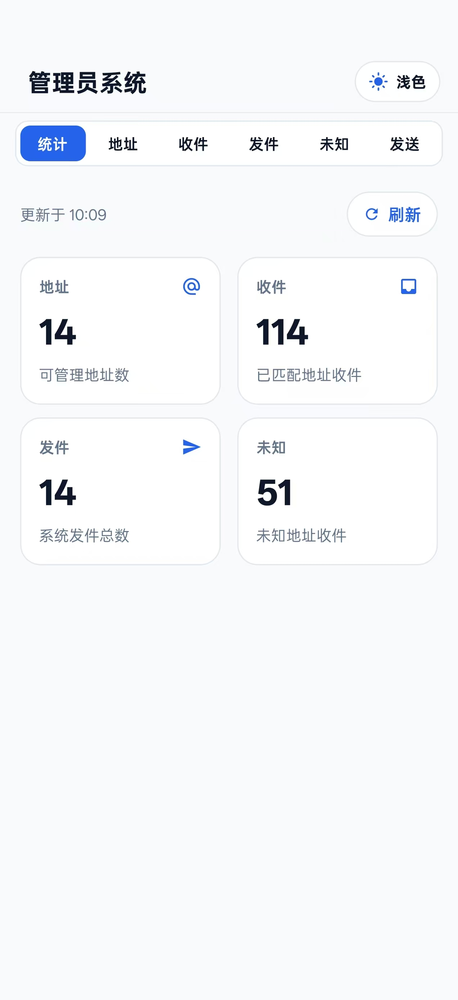
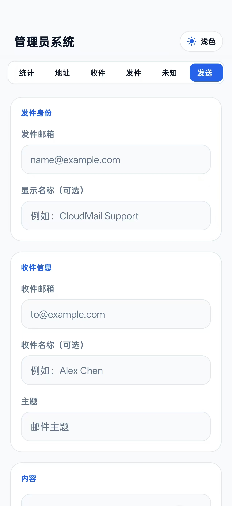
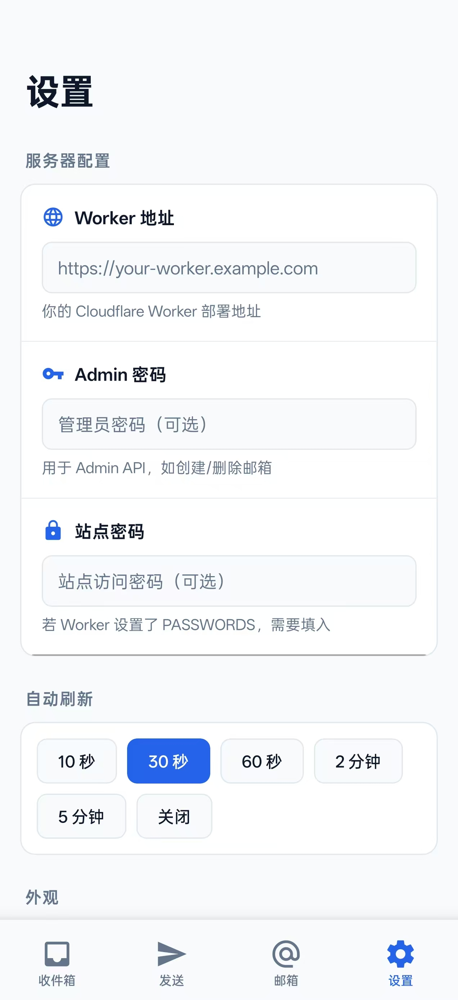
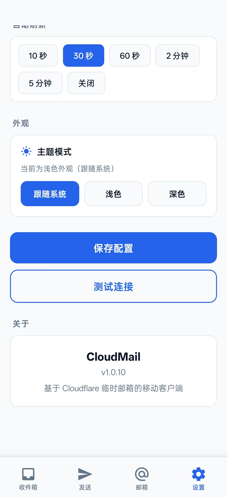

# CloudMail

<div align="center">
  

**V1.1.2 · 更快更稳的 Cloudflare Temp Email 移动端管理员 App**

[](https://github.com/Lur1N77777/CloudMail/actions/workflows/ci.yml)
[](./LICENSE)
[](https://expo.dev/)
[](https://reactnative.dev/)
[](https://www.typescriptlang.org/)

[简体中文](./README.md) · [English](./docs/README.en.md)

[下载 APK](https://github.com/Lur1N77777/CloudMail/releases) · [从源码构建](./docs/BUILD.md) · [API 说明](./docs/mailbox-api-report.md)

</div>

## 项目定位

CloudMail 是一个面向 **Cloudflare Temp Email / Cloudflare 临时邮箱** 的 Android 管理端 App，基于 Expo / React Native 开发，主要适配 [dreamhunter2333/cloudflare_temp_email](https://github.com/dreamhunter2333/cloudflare_temp_email) 及其兼容 API。

上游项目提供 Cloudflare Worker 邮箱后端、Web 管理端和邮箱收发能力；CloudMail 则把这些能力整理成更适合手机使用的管理员客户端。它不是新的邮箱后端，也不是 Cloudflare 官方产品，而是围绕 `cloudflare_temp_email` 项目生态开发的移动端管理工具。

CloudMail 当前主流程是 **管理员优先**：首次启动进入管理员设置，配置并校验成功后直接进入管理员后台，普通用户欢迎页不再作为主入口。

## V1.1.2 更新重点

V1.1.2 重点修复首次进入、刷新体验和大量数据场景下的稳定性，让管理员后台更快进入、更少空白、更适合长期管理大量邮箱。

- **进入后台更快**：保存 Workers 配置后先完成本地配置写入并立即进入管理员后台，重校验、统计和预热请求改为后台按需执行，避免首次点击“保存并进入管理员后台”长时间卡住。
- **地址页缓存优先**：地址列表新增持久化缓存，进入地址页会先显示上次数据，再后台刷新；删除、批量操作或切换页面后不再先空白再重新加载。
- **远端删除同步**：后台刷新会以服务端第一页为权威同步当前可见数据，网页端已删除的地址和邮件会在手机端刷新时被校正，不会长期残留旧缓存。
- **大量地址更稳**：地址全量索引和分组/搜索视图加入缓存，800+ 地址场景下分组、搜索和用户筛选更稳定；删除后会同步回退分页位置，避免列表被锁成空白。
- **邮件缓存与增量刷新**：收件、发件、未知和单地址邮件列表继续采用缓存优先、分页加载和后台增量更新，优先保证首屏响应速度。
- **一键登录链接**：Worker 档案可配置网页版邮箱地址，地址列表和地址详情可直接复制登录链接，便于把邮箱快速交给浏览器或其他设备使用。
- **刷新视觉统一**：移除顶部重复“更新中”动画，只保留下拉刷新或列表底部一个刷新指示；深色和 OLED 黑模式下刷新圆形背景同步适配主题。
- **时间显示修复**：统一 Worker 时间解析和上海时间显示，避免列表外层时间与详情页时间不一致。

## 功能亮点

- **Cloudflare Temp Email 移动管理员端**：连接你的 `cloudflare_temp_email` 兼容 Worker/API，在手机上管理临时邮箱系统。
- **多 Cloudflare 账号 / 多 Worker**：本地保存多个 Worker 配置档案，适合账号 A 管 `1.com / 2.com / 3.com`、账号 B 管 `4.com / 5.com / 6.com` 这类部署。
- **域名自动路由**：创建邮箱时按所选域名自动调用对应 Worker，减少手动切换和误操作。
- **管理员后台**：统计、地址、收件、发件、未知收件和发送邮件集中管理。
- **用户维度管理**：读取管理员用户列表，并查看某个用户名下绑定的邮箱地址。
- **邮箱地址管理**：创建自定义邮箱、子域名邮箱、随机子域名邮箱，查看凭证、复制一键登录链接、清空收件箱、删除地址。
- **批量操作**：可按当前筛选结果批量处理地址和地址下邮件，危险操作前提供预览与确认。
- **本地分组**：给邮箱地址分组，并在地址和邮件列表中按分组筛选。
- **收件 / 垃圾信箱**：在收件页内切换普通收件箱和垃圾信箱，通过长按邮件拒收或取消拒收发件人。
- **收件 / 发件 / 未知地址**：查看系统收件、发件记录，以及发往未创建地址的邮件；未知地址可一键创建为正式邮箱。
- **验证码快捷处理**：自动识别常见验证码，一键复制并显示成功提示。
- **新邮件提醒**：本地记录新邮件/已读状态，历史邮件默认不打扰，新刷新出的邮件会显示轻量小圆点。
- **HTML 邮件阅读**：支持富文本 HTML、纯文本、源文本和邮件详情查看。
- **主题与夜间阅读**：支持浅色、普通深色、OLED 黑和跟随系统；深色快捷切换会记住你偏好的黑色类型。
- **自托管友好**：邮箱服务由你自己部署和控制，移动端只连接你的 Worker/API。

## 截图

点击缩略图可以打开原图查看。

| 预览                                                                                                                                         | 说明                                                                                                         |
| -------------------------------------------------------------------------------------------------------------------------------------------- | ------------------------------------------------------------------------------------------------------------ |
| <a href="./docs/screenshots/admin-dashboard.jpg"></a>   | **管理员统计面板**：集中展示可管理地址、收件、发件和未知地址收件数量，支持刷新和顶部标签切换。 |
| <a href="./docs/screenshots/compose-mail.jpg"></a>               | **发送邮件**：选择发件身份，填写收件人、主题和正文。                                                         |
| <a href="./docs/screenshots/settings-server.jpg"></a>       | **管理员设置**：配置 Worker 地址、Admin 密码、站点密码和自动刷新间隔。                                       |
| <a href="./docs/screenshots/settings-appearance.jpg"></a> | **外观设置**：选择浅色、深色、OLED 黑或跟随系统。                                                            |

## 下载与安装

从 [GitHub Releases](https://github.com/Lur1N77777/CloudMail/releases) 下载最新版 APK。

APK 不直接提交到源码仓库，构建产物通过 GitHub Releases 分发，以保持 Git 历史干净。

## 使用方式

### 1. 准备邮箱服务

CloudMail 需要连接到一个或多个已经部署好的 `cloudflare_temp_email` 兼容服务，也就是你的 Cloudflare 临时邮箱 Worker/API。你需要准备：

- **Worker 地址**：例如 `https://worker-a.example.com`、`https://worker-b.example.com`。
- **Admin 密码**：每个 Worker 对应自己的管理员密码。
- **站点密码**：如果某个 Worker 配置了 `PASSWORDS`，需要填写。
- **域名归属**：例如账号 A 的 Worker 管理 `1.com / 2.com / 3.com`，账号 B 的 Worker 管理 `4.com / 5.com / 6.com`。

如果还没有部署后端，请先参考上游项目 [cloudflare_temp_email](https://github.com/dreamhunter2333/cloudflare_temp_email)。

### 2. 首次配置

1. 安装并打开 CloudMail。
2. 首次启动会直接进入 **管理员设置**。
3. 在 **Workers 配置** 中添加一个或多个 Worker 档案，填写名称、Worker 地址、Admin 密码和站点密码。
4. 点击 **测试连接 / 刷新域名**，确认每个 Worker 可用并缓存域名列表。
5. 选择当前默认 Worker，并设置自动刷新时间。
6. 可在 **外观** 中选择浅色、深色、OLED 黑或跟随系统。
7. 保存配置后，CloudMail 会校验当前 Worker 的管理员密码；成功后自动进入 **管理员后台**。

### 3. 日常使用

- 再次打开应用时，如果配置仍有效，会直接进入管理员后台。
- 在管理员后台右上角点击 **设置** 可随时回到管理员设置页。
- Worker 档案里的 **前端地址** 用于生成一键登录链接；配置后可在地址列表或地址详情中直接复制登录链接。
- 管理员顶部的 Worker 名称可快速切换当前管理范围。
- 顶部标签支持点击切换。
- 主题快捷按钮会记住你偏好的深色类型：如果你选择过 OLED 黑，浅色切回深色时会回到 OLED 黑，而不是普通深色。
- 增量刷新出现的新邮件会显示小圆点；打开详情、复制验证码或全部已读后，小圆点会自动消失。
- 在收件页点击标题处的下拉入口，可切换收件箱和垃圾信箱。
- 长按邮件可打开操作菜单；长按地址可进入批量选择模式。
- 创建邮箱时，域名选择器会标注来源 Worker；选择某个域名后会自动路由到对应 Worker。

### 4. 管理员页面说明

- **统计**：查看当前 Worker 的地址数、收件数、发件数和未知地址收件数。
- **地址**：搜索、创建、分组、按用户筛选、查看凭证、清空收件箱、删除邮箱地址和批量管理。
- **收件**：查看全部收件，支持搜索、验证码复制、新邮件标识、垃圾信箱和分组筛选。
- **发件**：查看系统发件记录。
- **未知**：查看发往未创建邮箱地址的邮件，并可一键创建对应邮箱。
- **发送**：在当前 Worker 范围内选择发件身份并发送邮件。

## 技术栈

- Expo 54 / React Native 0.81
- React 19 / TypeScript 5.9
- Expo Router
- React Native Reanimated / Gesture Handler
- AsyncStorage / SecureStore
- WebView 邮件预览
- Vitest
- 可选 Drizzle 后端工具

## 本地开发

安装依赖：

```bash
pnpm install
```

启动完整开发环境：

```bash
pnpm dev
```

只启动 Expo：

```bash
pnpm dev:metro
```

提交前建议运行：

```bash
pnpm check
pnpm test
```

## 构建 Android APK

完整说明见 [BUILD.md](./docs/BUILD.md)。常用本地构建流程：

```bash
pnpm install
npx expo prebuild -p android --clean
cd android
./gradlew assembleRelease
```

生成的 APK 建议上传到 GitHub Releases，不要提交到 Git 仓库。

## 环境变量

复制示例配置：

```bash
cp .env.example .env.local
```

大多数邮箱连接配置都在应用内完成。环境变量主要用于本地开发、可选 OAuth / 服务端能力、数据库工具、Forge 集成和 AI 相关工具。

不要提交真实密码、管理员 token、邮箱凭证、API key 或数据库连接串。

## 项目文档

- [构建与安装指南](./docs/BUILD.md)
- [更新日志](./docs/CHANGELOG.md)
- [设计说明](./docs/design.md)
- [邮箱 API 报告](./docs/mailbox-api-report.md)
- [路线图](./docs/roadmap.md)
- [安全策略](./.github/SECURITY.md)
- [贡献指南](./.github/CONTRIBUTING.md)

## 致谢

CloudMail 基于 [dreamhunter2333/cloudflare_temp_email](https://github.com/dreamhunter2333/cloudflare_temp_email) 的 Cloudflare 临时邮箱项目生态开发。感谢 [dreamhunter2333](https://github.com/dreamhunter2333) 和上游项目贡献者提供邮箱后端、Web 管理能力和相关 API 行为。

更多致谢信息见 [NOTICE](./docs/NOTICE.md)。

## 许可证

CloudMail 使用 [MIT License](./LICENSE) 开源。请同时查看上游仓库的许可证和使用条款。
